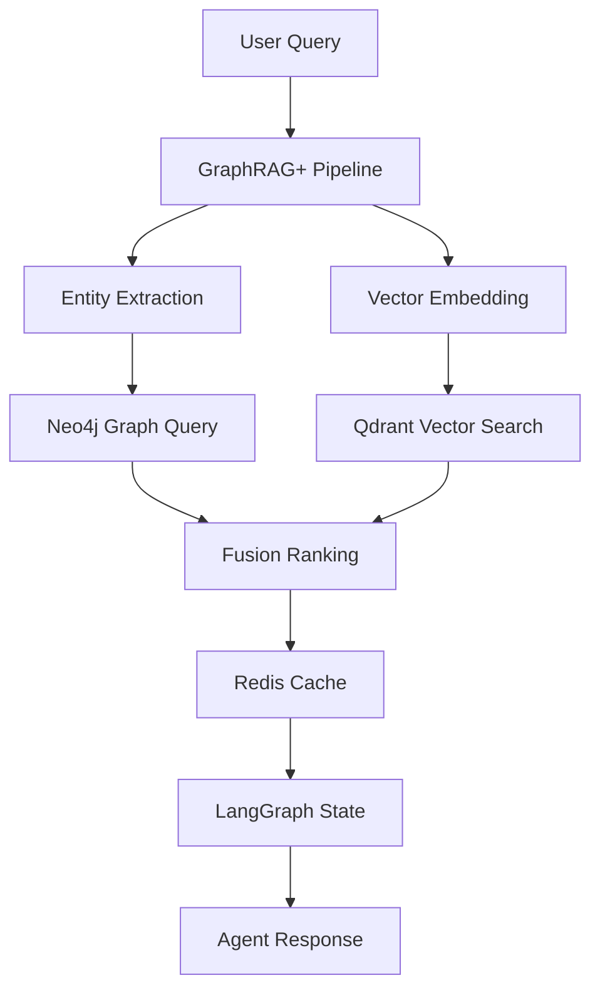

# ADR-002: Database and Memory System

**Status**: Accepted  

**Date**: 2025-07-20  

**Deciders**: CodeForge AI Team  

## Context

Scalable memory for RAG/state in Phase 1, extend to Phase 2 multi-modal/federated. The system needs to balance local deployment with accuracy requirements while supporting graph-based knowledge representation and vector similarity search.

## Problem Statement

Balance local/low-cost with accuracy across phases. Requirements include:

- Graph-based knowledge representation for entities and relationships

- Vector similarity search for semantic retrieval

- Fast caching and pub/sub for real-time coordination

- Extensibility for federated learning in Phase 2

- Local deployment option for cost control

## Decision

**Hybrid**: Neo4j (graphs) + Qdrant (vectors) + Redis (Pub/Sub/caching) in Phase 1, toggle SQLite; extend to Phase 2 with federated local aggregation.

## Alternatives Considered

| Solution | Pros | Cons | Score |
|----------|------|------|-------|
| **Neo4j + Qdrant + Redis** | Best-in-class for each use case, proven scalability | Multiple services, setup complexity | **8.7** |
| Pure Qdrant | Single service, good vector search | No native graph capabilities, limited relationship modeling | 7.5 |
| RaimaDB (embedded) | Single embedded solution | Overkill complexity, licensing costs | 7.0 |
| SQLite + pgvector | Lightweight, single file | Limited scalability, no native graph support | 7.2 |

## Rationale

- **Enables GraphRAG+ (8.7)**: 30% accuracy boost in Phase 1

- **Specialized tools**: Each database optimized for its use case

- **Scalable to Phase 2**: Natural extension to federated architectures

- **Local option**: SQLite toggle for cost-sensitive deployments

## Consequences

### Positive

- Best performance for each data type (graph, vector, cache)

- GraphRAG+ capabilities with entity relationship modeling

- High scalability for Phase 2 requirements

- Flexible deployment options

### Negative

- Multiple services increase deployment complexity

- Higher resource requirements than single-database solutions

- Need for service coordination and health monitoring

### Neutral

- Docker Compose required for Phase 1 setup

- Add Flower integration for Phase 2 federated capabilities

## Implementation Notes

### Phase 1 Setup
```python

# Database connections
neo4j_driver = GraphDatabase.driver("bolt://localhost:7687")
qdrant_client = QdrantClient("localhost", port=6333)
redis_client = redis.Redis(host='localhost', port=6379)

# GraphRAG+ integration
class HybridRAG:
    def __init__(self):
        self.graph_db = neo4j_driver
        self.vector_db = qdrant_client
        self.cache = redis_client
    
    def retrieve(self, query):
        # Hybrid graph + vector retrieval
        entities = self.extract_entities(query)
        graph_context = self.graph_db.run(cypher_query, entities=entities)
        vector_results = self.vector_db.search(query_vector)
        return self.fusion_rank(graph_context, vector_results)
```

### Docker Compose Configuration
```yaml
services:
  neo4j:
    image: neo4j:5.15
    environment:
      NEO4J_AUTH: neo4j/password
    ports:
      - "7474:7474"
      - "7687:7687"
  
  qdrant:
    image: qdrant/qdrant:v1.7.3
    ports:
      - "6333:6333"
  
  redis:
    image: redis:7.2-alpine
    ports:
      - "6379:6379"
```

## Data Flow Architecture



## Performance Targets

| Metric | Phase 1 Target | Phase 2 Target |
|--------|----------------|----------------|
| Query Latency | <100ms | <150ms (with multi-modal) |
| Accuracy Improvement | +30-40% | +50-60% (cumulative) |
| Cache Hit Rate | >80% | >85% |
| Concurrent Users | 10 | 100+ |

## Related Decisions

- ADR-006: SOTA GraphRAG Implementation

- ADR-005: Caching and Shared Context Layer

- ADR-010: Task Management System

## Monitoring

- Database connection health checks

- Query performance metrics

- Cache hit/miss ratios

- Storage utilization tracking

- Cross-service latency monitoring
