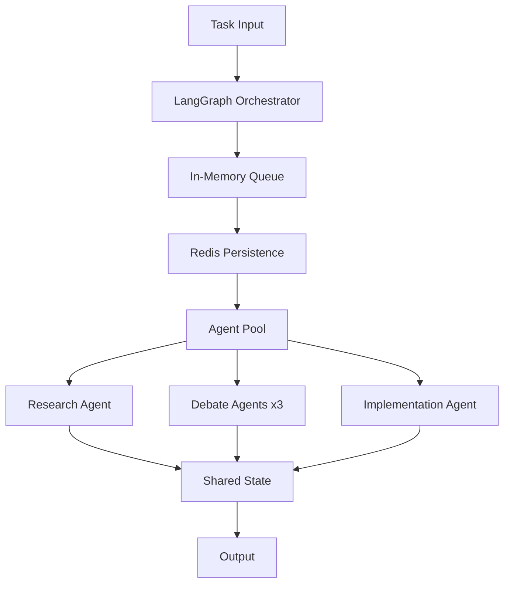
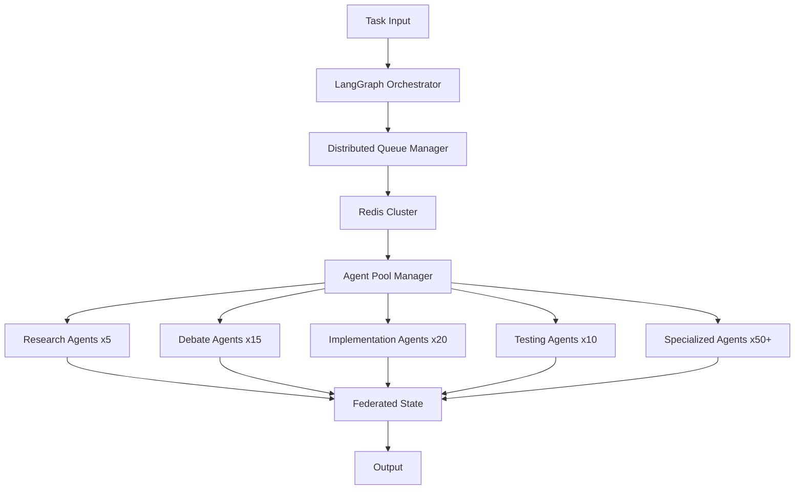

# ADR-004: Orchestration and Task Management

**Status**: Accepted  

**Date**: 2025-07-20  

**Deciders**: CodeForge AI Team  

## Context

Dynamic workflows/task coordination in Phase 1, scale to Phase 2 extended agents. The system needs to handle complex agent coordination, task distribution, and workflow management while maintaining low latency and high reliability.

## Problem Statement

Coordinate dynamic workflows and task management across phases. Requirements include:

- Real-time task assignment and coordination

- Low-latency agent-to-agent communication

- Persistent task state across restarts

- Scalability from 3 agents (Phase 1) to 500+ agents (Phase 2)

- Workflow orchestration with complex dependencies

## Decision

**LangGraph graphs** with **hybrid in-memory deque + Redis Pub/Sub** in Phase 1; extend to Phase 2 with 5-agent support.

## Alternatives Considered

| Approach | Pros | Cons | Score |
|----------|------|------|-------|
| **LangGraph + Hybrid Queue** | Graph-based workflows, low latency, persistent | Setup complexity | **8.6** |
| Pure CLI orchestration | Simple, direct control | High overhead, poor scalability | 7.5 |
| Pure Database queue | Persistent, scalable | Higher latency for real-time ops | 7.6 |
| Celery + Redis | Mature, battle-tested | Heavyweight, complex for simple cases | 8.0 |

## Rationale

- **Low-latency/efficiency (8.6)**: +30% coordination improvement in Phase 1

- **Scalable architecture**: Natural extension to Phase 2 with larger agent pools

- **Best of both worlds**: In-memory speed with persistent reliability

- **Graph-based workflows**: Complex dependencies and conditional logic

## Consequences

### Positive

- Optimal performance for real-time agent coordination

- Rich workflow definition capabilities through LangGraph

- Persistent task state survives restarts

- Scalable to Phase 2 requirements

### Negative

- Increased architectural complexity

- Need for Redis infrastructure

- Synchronization overhead between in-memory and persistent stores

### Neutral

- Centralized assignment coordination in Phase 1

- Toggle for Phase 2 extended agent support

## Implementation Notes

### Workflow Definition
```python
from langgraph.graph import StateGraph, add_messages
from collections import deque
import redis
import asyncio

class TaskState(TypedDict):
    task_id: str
    status: str  # pending, in_progress, completed, failed
    assigned_agent: str
    priority: int
    dependencies: List[str]
    result: Optional[dict]

class TaskManager:
    def __init__(self):
        self.in_memory_queue = deque()
        self.redis_client = redis.Redis(host='localhost', port=6379, decode_responses=True)
        self.task_states = {}
    
    async def assign_task(self, task: TaskState) -> str:
        # In-memory for speed
        self.in_memory_queue.append(task)
        # Redis for persistence
        await self.redis_client.hset(f"task:{task['task_id']}", mapping=task)
        # Pub/Sub notification
        await self.redis_client.publish('task_assignments', task['task_id'])
        return task['task_id']
```

### Agent Coordination
```python
class AgentCoordinator:
    def __init__(self, agent_id: str):
        self.agent_id = agent_id
        self.task_manager = TaskManager()
        self.redis_client = redis.Redis(host='localhost', port=6379, decode_responses=True)
    
    async def listen_for_tasks(self):
        pubsub = self.redis_client.pubsub()
        await pubsub.subscribe('task_assignments')
        
        async for message in pubsub.listen():
            if message['type'] == 'message':
                task_id = message['data']
                await self.try_claim_task(task_id)
    
    async def try_claim_task(self, task_id: str):
        # Atomic task claiming using Redis
        claimed = await self.redis_client.set(
            f"claim:{task_id}", 
            self.agent_id, 
            nx=True, 
            ex=300  # 5 minute expiration
        )
        if claimed:
            await self.execute_task(task_id)
```

### Workflow Orchestration
```python
def create_development_workflow():
    workflow = StateGraph(State)
    
    # Core workflow nodes
    workflow.add_node('task_assignment', assign_development_task)
    workflow.add_node('research_phase', research_agent)
    workflow.add_node('debate_phase', debate_subgraph)
    workflow.add_node('implementation', implementation_agent)
    workflow.add_node('testing', testing_agent)
    workflow.add_node('review', review_agent)
    
    # Conditional edges based on task requirements
    workflow.add_conditional_edges(
        'task_assignment',
        route_by_task_type,
        {
            'research_needed': 'research_phase',
            'direct_implementation': 'implementation',
            'complex_decision': 'debate_phase'
        }
    )
    
    # Sequential edges for standard flow
    workflow.add_edge('research_phase', 'debate_phase')
    workflow.add_edge('debate_phase', 'implementation')
    workflow.add_edge('implementation', 'testing')
    workflow.add_edge('testing', 'review')
    
    return workflow.compile(checkpointer=MemorySaver())
```

## Task Priority System

```python
class TaskPriority(Enum):
    CRITICAL = 1    # Security issues, build breaks
    HIGH = 2        # Feature development, major bugs
    MEDIUM = 3      # Enhancements, minor bugs
    LOW = 4         # Documentation, cleanup

class PriorityQueue:
    def __init__(self):
        self.queues = {priority: deque() for priority in TaskPriority}
    
    def add_task(self, task: TaskState):
        priority = TaskPriority(task['priority'])
        self.queues[priority].append(task)
    
    def get_next_task(self) -> Optional[TaskState]:
        for priority in TaskPriority:
            if self.queues[priority]:
                return self.queues[priority].popleft()
        return None
```

## Scalability Architecture

### Phase 1 (3-5 Agents)


### Phase 2 (100+ Agents)


## Performance Targets

| Metric | Phase 1 Target | Phase 2 Target |
|--------|----------------|----------------|
| Task Assignment Latency | <10ms | <50ms |
| Agent Response Time | <100ms | <200ms |
| Concurrent Tasks | 10 | 100+ |
| Workflow Completion | <5 minutes | <10 minutes |
| System Availability | 99% | 99.9% |

## Monitoring and Observability

```python
class TaskMetrics:
    def __init__(self):
        self.task_counters = defaultdict(int)
        self.timing_metrics = defaultdict(list)
    
    def record_task_start(self, task_id: str, task_type: str):
        self.task_counters[f"{task_type}_started"] += 1
        self.timing_metrics[task_id] = {'start_time': time.time()}
    
    def record_task_completion(self, task_id: str, task_type: str, success: bool):
        end_time = time.time()
        start_time = self.timing_metrics[task_id]['start_time']
        duration = end_time - start_time
        
        self.task_counters[f"{task_type}_completed"] += 1
        if success:
            self.task_counters[f"{task_type}_success"] += 1
        else:
            self.task_counters[f"{task_type}_failed"] += 1
```

## Related Decisions

- ADR-001: Multi-Agent Framework Selection

- ADR-005: Caching and Shared Context Layer

- ADR-010: Task Management System

## Monitoring

- Task queue depths and processing rates

- Agent utilization and idle time

- Workflow completion times

- Redis Pub/Sub message latencies

- Cross-agent coordination efficiency
