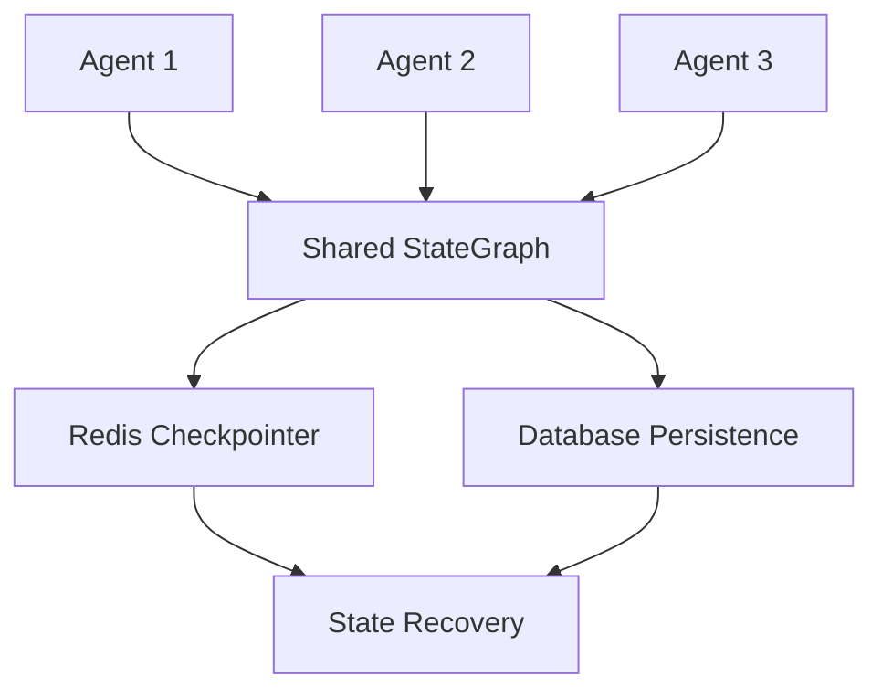
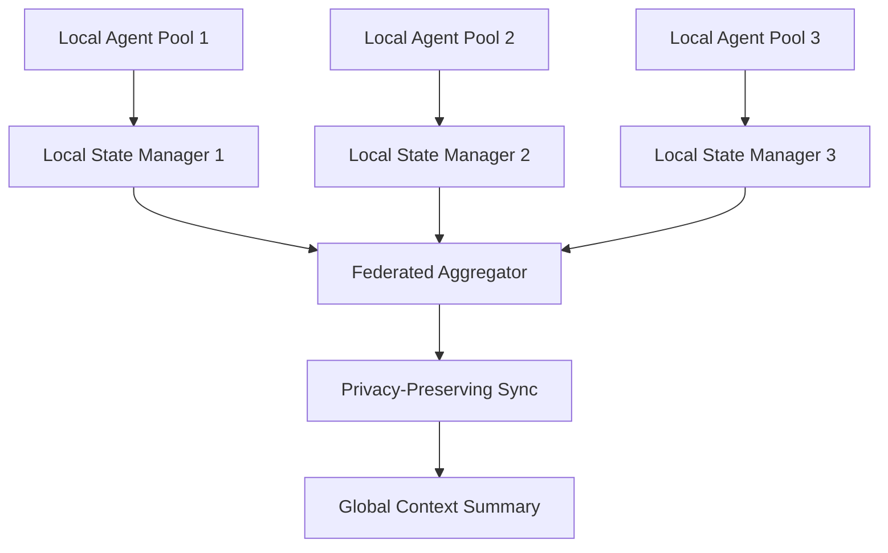

# ADR-005: Caching and Shared Context Layer

**Status**: Accepted  

**Date**: 2025-07-20  

**Deciders**: CodeForge AI Team  

## Context

Real-time shared state in Phase 1, extend to Phase 2 federated privacy. The system needs efficient context sharing between agents while preventing hallucinations and maintaining performance across distributed agent networks.

## Problem Statement

Provide efficient shared context for anti-hallucination collaboration across phases. Requirements include:

- Real-time state synchronization between agents

- Prevention of context drift and hallucinations

- Hierarchical memory (short-term/long-term)

- Privacy-preserving state sharing for Phase 2

- Low-latency access (<1ms for frequent operations)

## Decision

**LangGraph StateGraph** with hierarchical memory (short-term shared messages, long-term checkpointers/DB) in Phase 1; extend to Phase 2 with federated local states.

## Alternatives Considered

| Approach | Pros | Cons | Score |
|----------|------|------|-------|
| **LangGraph StateGraph** | Built-in state management, anti-hallucination features | Framework dependency | **8.9** |
| Redis-only state | Fast, simple, well-understood | No hierarchical structure, limited features | 8.0 |
| In-memory Dict | Maximum speed, simple implementation | No persistence, no sharing across restarts | 7.9 |
| Custom State Manager | Full control, optimized for use case | High development cost, maintenance burden | 7.5 |

## Rationale

- **Anti-hallucination collaboration (8.9)**: Built-in features for consistent state

- **Phase 1 performance gains**: Measured improvements in agent coordination

- **Phase 2 privacy**: Natural extension to federated architectures

- **Framework integration**: Seamless with LangGraph orchestration

## Consequences

### Positive

- Automatic state synchronization across agents

- Built-in anti-hallucination mechanisms

- Hierarchical memory supports different access patterns

- Natural extension to federated privacy models

### Negative

- Framework lock-in with LangGraph

- Need for careful state size management

- Potential bottlenecks in high-concurrency scenarios

### Neutral

- Message limits required to prevent bloat

- Add Flower integration for Phase 2 federated capabilities

## Implementation Notes

### State Schema Design
```python
from langgraph.graph import add_messages
from typing import TypedDict, Annotated, List, Dict, Optional

class SharedState(TypedDict):
    # Short-term: Active conversation and immediate context
    messages: Annotated[List[dict], add_messages]
    current_task: Optional[dict]
    active_agents: List[str]
    
    # Medium-term: Session and workflow context
    workflow_context: dict
    agent_capabilities: Dict[str, List[str]]
    task_history: List[dict]
    
    # Metadata for coordination
    state_version: int
    last_updated: float
    coordination_locks: Dict[str, str]

class PrivateState(TypedDict):
    # Agent-specific state (not shared)
    agent_id: str
    internal_reasoning: List[str]
    private_tools: Dict[str, Any]
    agent_config: dict
```

### State Management Implementation
```python
class StateManager:
    def __init__(self, checkpointer_type="memory"):
        self.shared_state = {}
        self.private_states = {}
        self.checkpointer = self._create_checkpointer(checkpointer_type)
        self.message_limit = 100  # Prevent state bloat
        
    def update_shared_state(self, agent_id: str, updates: dict) -> None:
        """Thread-safe state updates with conflict resolution"""
        with self._state_lock:
            # Increment version for optimistic locking
            current_version = self.shared_state.get('state_version', 0)
            
            # Merge updates intelligently
            self.shared_state.update(updates)
            self.shared_state['state_version'] = current_version + 1
            self.shared_state['last_updated'] = time.time()
            
            # Trim messages to prevent bloat
            if len(self.shared_state.get('messages', [])) > self.message_limit:
                self.shared_state['messages'] = self.shared_state['messages'][-self.message_limit:]
            
            # Persist to checkpointer
            self.checkpointer.save(self.shared_state)
    
    def get_context_for_agent(self, agent_id: str) -> dict:
        """Get relevant context subset for specific agent"""
        shared_context = self._filter_shared_context(agent_id)
        private_context = self.private_states.get(agent_id, {})
        
        return {
            'shared': shared_context,
            'private': private_context,
            'metadata': {
                'state_version': self.shared_state.get('state_version', 0),
                'context_timestamp': time.time()
            }
        }
```

### Anti-Hallucination Mechanisms
```python
class HallucinationPrevention:
    def __init__(self, state_manager: StateManager):
        self.state_manager = state_manager
        self.fact_checker = FactChecker()
        self.consistency_checker = ConsistencyChecker()
    
    def validate_agent_contribution(self, agent_id: str, contribution: dict) -> bool:
        """Validate agent contributions before state updates"""
        
        # Check factual consistency with existing state
        current_context = self.state_manager.get_context_for_agent(agent_id)
        if not self.fact_checker.is_consistent(contribution, current_context):
            logger.warning(f"Inconsistent contribution from {agent_id}")
            return False
        
        # Check for hallucinated information
        if self.fact_checker.contains_hallucination(contribution):
            logger.warning(f"Potential hallucination detected from {agent_id}")
            return False
        
        # Check cross-agent consistency
        if not self.consistency_checker.validate_cross_agent(contribution, current_context):
            logger.warning(f"Cross-agent inconsistency from {agent_id}")
            return False
        
        return True
    
    def resolve_conflicts(self, conflicting_updates: List[dict]) -> dict:
        """Resolve conflicts between concurrent agent updates"""
        # Implement conflict resolution strategy
        # Priority: Recent > High-confidence > Specific agent roles
        return self.consistency_checker.resolve_conflicts(conflicting_updates)
```

### Memory Hierarchy
```python
class HierarchicalMemory:
    def __init__(self):
        self.short_term = {}    # In-memory, fast access
        self.medium_term = {}   # Redis, session persistence
        self.long_term = {}     # Database, permanent storage
    
    def store(self, key: str, value: Any, level: str = "short_term") -> None:
        if level == "short_term":
            self.short_term[key] = value
        elif level == "medium_term":
            self.medium_term[key] = value
            self._persist_to_redis(key, value)
        elif level == "long_term":
            self.long_term[key] = value
            self._persist_to_database(key, value)
    
    def retrieve(self, key: str) -> Any:
        # Try short-term first, then medium, then long-term
        if key in self.short_term:
            return self.short_term[key]
        elif key in self.medium_term:
            return self.medium_term[key]
        else:
            # Load from persistent storage
            value = self._load_from_persistent(key)
            if value is not None:
                self.short_term[key] = value  # Cache for fast access
            return value
```

## State Synchronization Patterns

### Phase 1: Centralized State


### Phase 2: Federated State


## Performance Optimization

### Caching Strategy
```python
class StateCache:
    def __init__(self, max_size=1000, ttl=300):
        self.cache = {}
        self.max_size = max_size
        self.ttl = ttl
        self.access_times = {}
    
    def get(self, key: str) -> Optional[Any]:
        if key in self.cache:
            # Check TTL
            if time.time() - self.access_times[key] < self.ttl:
                self.access_times[key] = time.time()
                return self.cache[key]
            else:
                # Expired
                del self.cache[key]
                del self.access_times[key]
        return None
    
    def set(self, key: str, value: Any) -> None:
        # Evict if at capacity
        if len(self.cache) >= self.max_size:
            oldest_key = min(self.access_times.keys(), 
                           key=lambda k: self.access_times[k])
            del self.cache[oldest_key]
            del self.access_times[oldest_key]
        
        self.cache[key] = value
        self.access_times[key] = time.time()
```

## Phase 2 Extensions

### Federated State Management
```python
class FederatedStateManager:
    def __init__(self, node_id: str):
        self.node_id = node_id
        self.local_state = StateManager()
        self.federation_client = FederationClient()
    
    async def sync_with_federation(self) -> None:
        """Privacy-preserving state synchronization"""
        # Extract non-sensitive summary
        local_summary = self._create_privacy_preserving_summary()
        
        # Exchange with other nodes
        federated_summaries = await self.federation_client.exchange_summaries(
            local_summary
        )
        
        # Update local context with federated insights
        self._integrate_federated_context(federated_summaries)
    
    def _create_privacy_preserving_summary(self) -> dict:
        """Create summary that preserves privacy"""
        return {
            'task_types_completed': self._get_task_type_counts(),
            'success_rates': self._get_success_metrics(),
            'capability_utilization': self._get_capability_usage(),
            # Exclude: specific code, user data, proprietary logic
        }
```

## Performance Targets

| Metric | Phase 1 Target | Phase 2 Target |
|--------|----------------|----------------|
| State Access Latency | <1ms | <5ms |
| State Update Latency | <10ms | <50ms |
| Memory Usage | <100MB | <500MB |
| Sync Frequency | Real-time | Every 30s |
| Conflict Resolution | <100ms | <200ms |

## Related Decisions

- ADR-002: Database and Memory System

- ADR-004: Orchestration and Task Management

- ADR-014: Federated Basics (Phase 2)

## Monitoring

- State access patterns and hit rates

- State size growth and trimming effectiveness

- Conflict resolution frequency and success

- Cross-agent consistency metrics

- Privacy preservation compliance (Phase 2)
