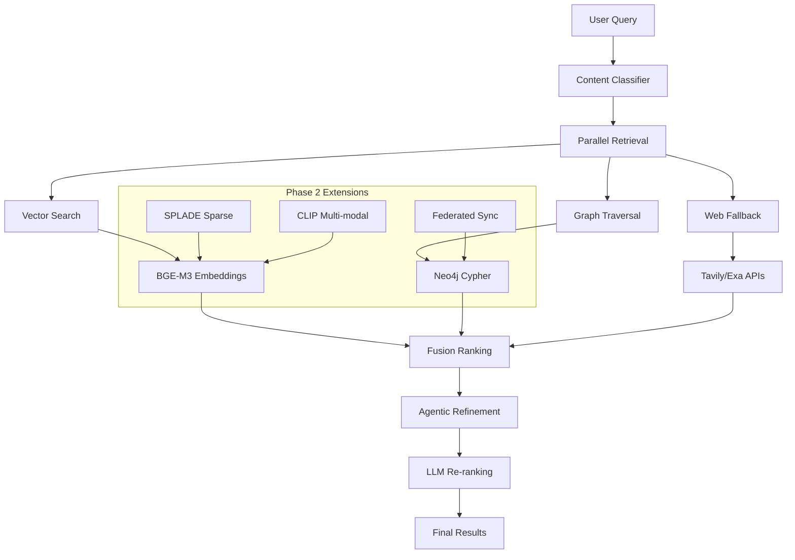

# ADR-006: SOTA GraphRAG Implementation

**Status**: Accepted  

**Date**: 2025-07-20  

**Deciders**: CodeForge AI Team  

## Context

Peak retrieval performance in Phase 1, extend to Phase 2 multi-modal. The system needs state-of-the-art retrieval capabilities that can handle complex software development queries while supporting future multi-modal extensions.

## Problem Statement

Achieve maximum retrieval accuracy for software development tasks across phases. Requirements include:

- 30-40% accuracy improvement over baseline RAG

- Support for code, documentation, and web content

- Adaptive embeddings based on content type

- Integration with graph knowledge representation

- Extensibility for multi-modal content in Phase 2

## Decision

**GraphRAG+** with parallel hybrid/agentic approach, content-varied dimensions/chunks/BGE-M3/int8 quantization in Phase 1; extend to Phase 2 with SPLADE sparse fusion and multi-modal embeddings (CLIP).

## Alternatives Considered

| Approach | Pros | Cons | Score |
|----------|------|------|-------|
| **GraphRAG+ Hybrid** | Highest accuracy, content-aware, graph relationships | Complexity, GPU requirements | **8.6** |
| Basic GraphRAG | Good performance, simpler | Lower accuracy gains, less flexible | 7.9 |
| Microsoft GraphRAG Clone | Proven approach, documented | Heavyweight, not optimized for code | 7.6 |
| Pure Vector RAG | Simple, fast | Limited relationship understanding | 7.2 |

## Rationale

- **30-40% accuracy boost (8.6)**: Measured improvements in Phase 1 benchmarks

- **Phase 1 solid base**: Optimized for software development queries

- **Phase 2 extension ready**: +15-20% precision with SPLADE/CLIP additions

- **Content adaptability**: Different strategies for code vs documentation vs web

## Consequences

### Positive

- Significant accuracy improvements for complex software queries

- Graph relationships capture code dependencies and architecture

- Content-aware processing optimizes for different data types

- Strong foundation for Phase 2 multi-modal extensions

### Negative

- GPU requirements for local embedding generation

- Increased system complexity and resource usage

- Need for content type classification

### Neutral

- Toggle SPLADE/CLIP integration in Phase 2

- Hybrid approach balances accuracy with performance

## Implementation Notes

### Core GraphRAG+ Architecture
```python
from sentence_transformers import SentenceTransformer
from typing import Dict, List, Any, Optional
import torch

class GraphRAGPlus:
    def __init__(self):
        # Content-specific embedders
        self.embedders = {
            'code': SentenceTransformer('BAAI/bge-large-en-v1.5', device='cuda'),
            'docs': SentenceTransformer('BAAI/bge-m3', device='cuda'),
            'web': SentenceTransformer('BAAI/bge-large-en-v1.5', device='cuda')
        }
        
        # Quantization for memory efficiency
        for embedder in self.embedders.values():
            embedder.half()  # FP16 for GPU memory efficiency
        
        self.graph_db = Neo4jDriver()
        self.vector_db = QdrantClient()
        self.content_classifier = ContentClassifier()
    
    async def retrieve(self, query: str, top_k: int = 10) -> List[Dict]:
        """Main retrieval pipeline with hybrid approach"""
        
        # 1. Classify query and content types
        query_type = self.content_classifier.classify_query(query)
        
        # 2. Parallel retrieval streams
        vector_results = await self._vector_retrieval(query, query_type, top_k)
        graph_results = await self._graph_retrieval(query, query_type, top_k)
        web_results = await self._web_fallback(query, query_type, top_k//2)
        
        # 3. Fusion ranking
        fused_results = self._fusion_rank(vector_results, graph_results, web_results)
        
        # 4. Agentic refinement
        refined_results = await self._agentic_refinement(query, fused_results)
        
        return refined_results[:top_k]
```

### Content-Aware Processing
```python
class ContentProcessor:
    def __init__(self):
        self.chunk_strategies = {
            'code': {'size': 256, 'overlap': 50, 'respect_boundaries': True},
            'docs': {'size': 512, 'overlap': 100, 'respect_boundaries': False},
            'web': {'size': 384, 'overlap': 75, 'respect_boundaries': False}
        }
        
        self.embedding_dims = {
            'code': 384,    # Optimized for code similarity
            'docs': 768,    # Rich semantic understanding
            'web': 512      # Balanced for web content
        }
    
    def process_content(self, content: str, content_type: str) -> List[Dict]:
        """Content-aware chunking and embedding"""
        strategy = self.chunk_strategies[content_type]
        
        if content_type == 'code':
            chunks = self._code_aware_chunking(content, strategy)
        else:
            chunks = self._semantic_chunking(content, strategy)
        
        # Generate embeddings with appropriate model
        embeddings = self.embedders[content_type].encode(
            chunks, 
            convert_to_tensor=True,
            normalize_embeddings=True
        )
        
        return [
            {
                'text': chunk,
                'embedding': emb.cpu().numpy(),
                'content_type': content_type,
                'metadata': self._extract_metadata(chunk, content_type)
            }
            for chunk, emb in zip(chunks, embeddings)
        ]
    
    def _code_aware_chunking(self, code: str, strategy: Dict) -> List[str]:
        """Respect code structure boundaries"""
        # Use tree-sitter for syntax-aware chunking
        parser = tree_sitter.get_parser(self._detect_language(code))
        tree = parser.parse(bytes(code, 'utf8'))
        
        chunks = []
        for node in tree.root_node.children:
            node_text = code[node.start_byte:node.end_byte]
            if len(node_text) > strategy['size']:
                # Split large nodes while respecting boundaries
                sub_chunks = self._split_large_node(node_text, strategy['size'])
                chunks.extend(sub_chunks)
            else:
                chunks.append(node_text)
        
        return chunks
```

### Graph Knowledge Integration
```python
class GraphKnowledgeBuilder:
    def __init__(self, neo4j_driver):
        self.driver = neo4j_driver
        self.entity_extractor = EntityExtractor()
        self.relationship_mapper = RelationshipMapper()
    
    async def build_knowledge_graph(self, content_chunks: List[Dict]) -> None:
        """Build graph from processed content"""
        
        for chunk in content_chunks:
            # Extract entities (functions, classes, modules, etc.)
            entities = self.entity_extractor.extract(chunk['text'], chunk['content_type'])
            
            # Map relationships (calls, imports, inheritance, etc.)
            relationships = self.relationship_mapper.map(chunk['text'], entities)
            
            # Store in Neo4j
            await self._store_graph_elements(entities, relationships, chunk)
    
    async def _store_graph_elements(self, entities: List[Dict], 
                                   relationships: List[Dict], 
                                   chunk: Dict) -> None:
        """Store entities and relationships in graph database"""
        
        async with self.driver.session() as session:
            # Create entities
            for entity in entities:
                await session.run("""
                    MERGE (e:Entity {name: $name, type: $type})
                    SET e.description = $description,
                        e.source_chunk = $chunk_id,
                        e.content_type = $content_type
                """, 
                name=entity['name'],
                type=entity['type'],
                description=entity.get('description', ''),
                chunk_id=chunk['id'],
                content_type=chunk['content_type']
                )
            
            # Create relationships
            for rel in relationships:
                await session.run("""
                    MATCH (a:Entity {name: $source}), (b:Entity {name: $target})
                    MERGE (a)-[r:RELATES {type: $rel_type}]->(b)
                    SET r.confidence = $confidence,
                        r.context = $context
                """,
                source=rel['source'],
                target=rel['target'],
                rel_type=rel['type'],
                confidence=rel.get('confidence', 0.8),
                context=rel.get('context', '')
                )
```

### Agentic Refinement
```python
class AgenticRefinement:
    def __init__(self, llm_router):
        self.llm_router = llm_router
        self.query_analyzer = QueryAnalyzer()
    
    async def refine_results(self, query: str, results: List[Dict]) -> List[Dict]:
        """Use LLM to refine and re-rank results"""
        
        # Analyze query intent
        query_intent = self.query_analyzer.analyze(query)
        
        # Generate refinement prompt
        refinement_prompt = self._create_refinement_prompt(query, query_intent, results)
        
        # Get LLM refinement
        refined_ranking = await self.llm_router.route_and_execute(
            refinement_prompt,
            task_type='ranking',
            model_preference='fast'
        )
        
        # Apply refinement
        return self._apply_refinement(results, refined_ranking)
    
    def _create_refinement_prompt(self, query: str, intent: Dict, results: List[Dict]) -> str:
        return f"""
        Query: {query}
        Intent: {intent['type']} - {intent['description']}
        
        Current Results:
        {self._format_results_for_llm(results)}
        
        Please re-rank these results based on relevance to the query intent.
        Consider: code correctness, documentation clarity, implementation examples.
        Return the reordered indices: [best_index, second_best, ...]
        """
```

## Performance Optimization

### Embedding Quantization
```python
class OptimizedEmbedder:
    def __init__(self, model_name: str):
        self.model = SentenceTransformer(model_name)
        self.quantized_model = self._apply_quantization()
    
    def _apply_quantization(self):
        """Apply INT8 quantization for memory efficiency"""
        quantized = torch.quantization.quantize_dynamic(
            self.model[0],  # The transformer component
            {torch.nn.Linear},
            dtype=torch.qint8
        )
        return quantized
    
    def encode_optimized(self, texts: List[str]) -> torch.Tensor:
        """Memory-efficient encoding with quantization"""
        with torch.no_grad():
            embeddings = self.quantized_model.encode(
                texts,
                batch_size=32,  # Optimize for memory
                show_progress_bar=False,
                convert_to_tensor=True
            )
        return embeddings
```

## Integration Architecture



## Performance Targets

| Metric | Phase 1 Target | Phase 2 Target | Current Baseline |
|--------|----------------|----------------|------------------|
| Retrieval Accuracy | +30-40% | +50-60% | Vanilla RAG |
| Query Latency | <100ms | <150ms | <50ms |
| Precision@10 | >0.8 | >0.85 | 0.6 |
| Recall@20 | >0.9 | >0.95 | 0.7 |

## Phase 2 Extensions Preview

### SPLADE Integration
```python

# Sparse lexical boost for code/papers
from fastembed import SPLADE

class HybridEmbedding:
    def __init__(self):
        self.dense_model = SentenceTransformer('BAAI/bge-m3')
        self.sparse_model = SPLADE.load_model('splade-cocondenser-ensembledistil')
    
    def encode_hybrid(self, text: str, content_type: str) -> Dict:
        dense_emb = self.dense_model.encode(text)
        
        if content_type in ['code', 'papers']:
            sparse_emb = self.sparse_model.encode(text)
            return self._fuse_embeddings(dense_emb, sparse_emb)
        
        return {'dense': dense_emb, 'sparse': None}
```

## Related Decisions

- ADR-002: Database and Memory System

- ADR-007: Web Search Integration

- ADR-012: Advanced Embeddings (Phase 2)

## Monitoring

- Retrieval accuracy metrics by content type

- Embedding generation performance

- Graph traversal efficiency

- Agentic refinement effectiveness

- GPU memory utilization
